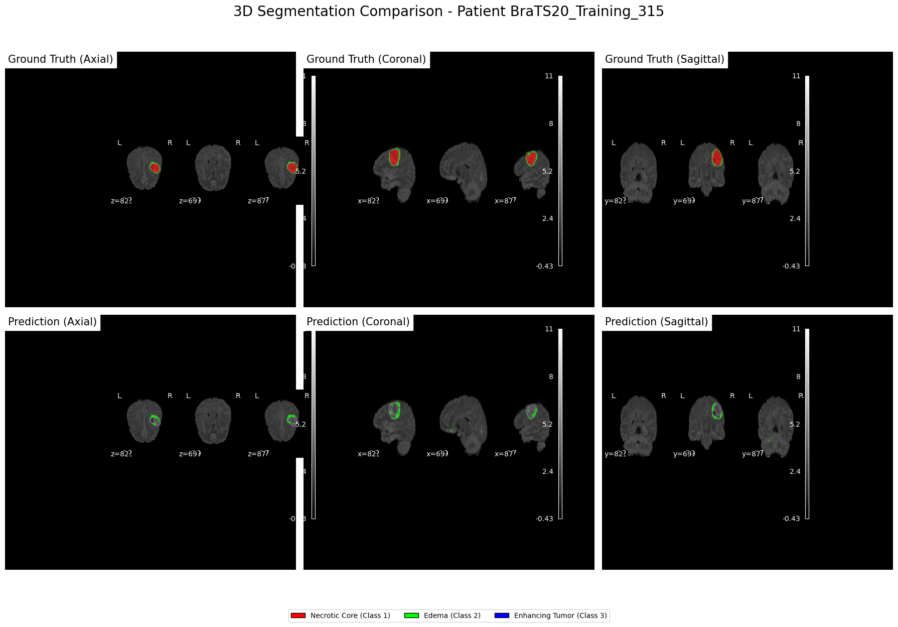
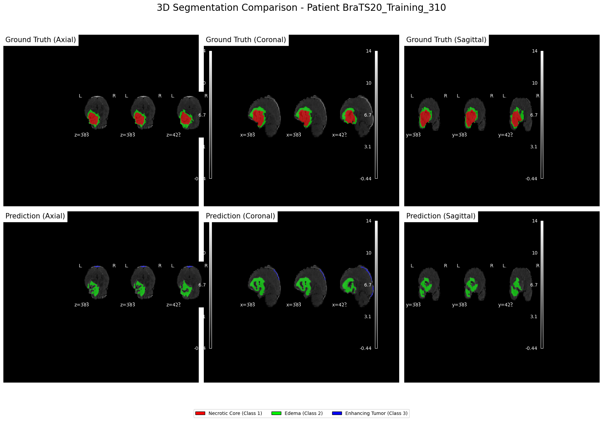

# 3D UNET Project for BraTS 2020 Brain Tumor Analysis

This project provides a complete pipeline for brain tumor analysis on the BraTS 2020 dataset, including 3D classification of tumors as benign or malignant, and 2D/3D segmentation of tumor sub-regions.

## Project Structure

```bash
brats_unet3d_project/
├── config/
│   └── config.yaml
├── data/
│   ├── brats2020_preprocess.py
│   ├── slicer.py
│   └── dataset_loader.py
├── models/
│   ├── unet2d.py
│   ├── unet3d.py
│   └── classifier3d.py
├── training/
│   ├── trainer2d.py
│   ├── trainer3d_cls.py
│   ├── trainer3d_seg.py
│   └── metrics.py
├── inference/
│   ├── predict2d.py
│   ├── reconstruct3d.py
│   └── visualizer.py
├── utils/
│   ├── logger.py
│   ├── helpers.py
│   └── augmentations.py
├── main.py
├── requirements.txt
├── install_dependencies.bat
└── README.md
```

## Features

* **End-to-End Pipeline:** From data preprocessing to model training, inference, and evaluation.
* **Multiple Models:**
    * **3D CNN Classifier:** Classifies entire MRI volumes as benign or malignant.
    * **2D UNET:** Segments tumor regions (WT, TC, ET) from 2D axial slices.
    * **3D UNET:** (For future extension to full 3D segmentation).
* **Modular and Object-Oriented:** Code is organized into logical, reusable classes.
* **Configurable:** A central `config.yaml` file controls all important parameters.
* **Data Preprocessing & Augmentation:** Includes skull stripping, normalization, resampling, and real-time data augmentation.
* **Evaluation:** Comprehensive evaluation scripts to compute Dice, IoU, Precision, Recall, and Hausdorff distance.
* **Visualization:** Generates visualizations of segmentation results.

## Setup

1.  **Clone the repository:**
    ```bash
    git clone https://github.com/UCKalyan/DSMLG2.git
    ```
    ```bash
    cd brats_unet3d_project
    ```

2.  **Install Dependencies:**
    Run the batch script to create a virtual environment and install the required packages.
    ```bash
    install_dependencies.bat
    ```
    This will create a `venv` folder and install all packages from `requirements.txt`.

3.  **Activate the Virtual Environment:**
    ```bash
    venv\Scripts\activate
    ```

4.  **Download BraTS 2020 Data:**
    Download the BraTS 2020 dataset and place it in a directory. Update the `data_path` in `config/config.yaml` to point to dataset location.

5. Ensure atleast 50GB of free space.
6.  in config.yaml -> 
* active_profile : gpu_high_mem # only if you have GPU and RAM
* epochs : 100 
* data_path: "/BraTS2020_TrainingData/MICCAI_BraTS2020_TrainingData" # Path to the main BraTS2020 dataset folder

## Usage

The `main.py` script is the main entry point for running different parts of the pipeline.

### Preprocessing Data used for 2D
* **Preprocess Dataset to .nyp format:** 
    ```bash
    python main.py --mode preprocess
    ```
Ensure to set the Folder where dataset is present in config.yaml.
data_path: "/BraTS2020_TrainingData/MICCAI_BraTS2020_TrainingData" # Path to the main BraTS2020 dataset folder

### Convert to TFRecords used for 3D
* **TFRecords for Production:** 
    ```bash
    python main.py --mode convert_to_tfrecord
    ```

### Training

* **Train a 2D Segmentation Model:**
    ```bash
    python main.py --mode train --model UNET2D
    ```

* **Train a 3D Classification Model:**
    ```bash
    python main.py --mode train --model Classifier3D --output_type benign_vs_malignant
    ```

* **Train a 3D Segmentation Model:**
    ```bash
    python main.py --mode train --model UNET3D
    ```

### Inference

* **Run 2D Segmentation and 3D Reconstruction:** eg:- BraTS20_Training_356
    ```bash
    python main.py --mode predict --model UNET2D --patient_id BraTS20_Training_XXX
    ```

* **Run 3D Segmentation and 3D Reconstruction:** eg:-BraTS20_Training_356
    ```bash
    python main.py --mode predict --model UNET3D --patient_id BraTS20_Training_XXX
    ```
* **Run 3D Classification :** eg:-BraTS20_Training_356
    ```bash
    python main.py --mode predict --model CLASSIFIER3D --patient_id BraTS20_Training_XXX
    ```
### Evaluation

* **Evaluate a trained UNET2D model:**
    ```bash
    python main.py --mode evaluate --model UNET2D
    ```
* **Evaluate a trained UNET3D model:**
    ```bash
    python main.py --mode evaluate --model UNET3D
    ```
* **Evaluate a trained CLASSIFIER3D model:**
    ```bash
    python main.py --mode evaluate --model CLASSIFIER3D
    ```

## Configuration

All parameters can be modified in `config/config.yaml`:

* `model`: Choose between `UNET2D`, `UNET3D`, `Classifier3D`.
* `encoder`: Encoder backbone for UNET models (e.g., `ResNet34`).
* `input_shape`: Input shape for the models.
* `loss_function`: Loss function for training.
* `batch_size`, `epochs`: Training parameters.
* `data_path`: Path to the BraTS 2020 dataset.
* ... and other model/data specific parameters.


## INFO

* Axial, Coronal, and Sagittal Planes:
* Axial: A horizontal plane dividing the body into upper and lower parts. In brain imaging, it's often referred to as the transverse plane.
* Coronal: A vertical plane dividing the body into front and back sections.
* Sagittal: A vertical plane dividing the body into left and right sections

Visualizing the BraTS Dataset:
1. Multi-Planar Reconstruction (MPR):
This technique allows you to view the same data in all three planes (axial, coronal, and sagittal) simultaneously or sequentially. This is often the first step in visualizing the dataset and getting a sense of the data.
2. 3D Rendering:
This approach combines the data from all three planes to create a 3D model of the brain and the tumor. This can be very helpful in understanding the tumor's shape, size, and location relative to surrounding structures.
3. Deep Learning Models:
Many deep learning models designed for brain tumor segmentation, particularly those utilizing 3D convolutions, are specifically designed to leverage information from all three planes. These models implicitly learn the relationships between the different views. Examples include models that use axial, coronal, and sagittal views, or models that decompose 3D convolutions into axial intra-slice and inter-slice convolutions. 
Why is understanding these planes important for BraTS?
Tumor Characteristics:
Different tumor characteristics might be more apparent in one plane than another. For example, the extent of edema (swelling around the tumor) might be more visible in the T2-weighted FLAIR images in the axial plane. 
Segmentation Accuracy:
Accurate brain tumor segmentation requires understanding the spatial context of the tumor within the brain. Combining information from all three planes is crucial for achieving high segmentation accuracy. 
Clinical Decision Making:
Radiologists use all three planes when manually segmenting tumors for diagnosis and treatment planning. Deep learning models should ideally mimic this process. 

### PostProcessing Implemented to processing slices individually with a 2D U-Net and then integrating 3D context
Processing Slices Individually with a 2D U-Net:

The inference/predict2d.py file, specifically the Predictor2D class, is designed to perform 2D predictions. Its predict_volume method iterates through 2D slices extracted from a 3D volume (model_input_slices) and uses a 2D Keras model (self.model.predict(s_expanded, verbose=0)) to get predictions for each slice. This confirms the "processing slices individually with a 2D U-Net" part.

Integrating 3D Context:

The inference/reconstruct3d.py file handles the integration of 3D context. The Reconstructor3D class first uses the stack_slices method to reassemble the predicted 2D slices back into a 3D volume.

Crucially, the post_process method then applies 3D morphological operations (remove_small_objects and binary_fill_holes) to the reconstructed 3D volume. These operations help ensure spatial consistency and remove artifacts across slices, effectively integrating 3D context after the 2D predictions. While it's not a hybrid model that learns 3D features during inference, it's a common and effective post-processing strategy to achieve 3D coherence.

### Best Image Format for Medical Imaging
The best image format for medical imaging among .nii.gz, .npy, and .tfrecord depends on the specific requirements of the task at hand.

* .nii.gz (NIfTI-1 compressed): This format is widely used in medical imaging, particularly in neuroimaging. It supports 3D and 4D data, includes metadata such as affine transformations for spatial orientation, and is compatible with many medical imaging tools and libraries like FSL, SPM, and NiBabel. The .nii.gz format is particularly useful for preserving the spatial and anatomical context of images, making it ideal for applications such as MRI and fMRI analysis. It is also supported by MedPy via SimpleITK.
* .npy (NumPy array): This format is native to Python’s NumPy library and is useful for storing multi-dimensional arrays. It is simple and efficient for loading and saving data within Python workflows. However, it lacks support for metadata such as spatial orientation or acquisition parameters, which are crucial in medical imaging. Therefore, .npy is more suitable for intermediate data storage or when metadata is managed separately.
* .tfrecord (TensorFlow Record): This is a binary file format used by TensorFlow for storing large datasets efficiently. It is particularly useful for machine learning pipelines where data needs to be read in a streaming fashion. While it supports flexible data structures and can store both images and labels, it does not inherently support metadata about the imaging context. It is more commonly used in deep learning applications but requires additional effort to manage metadata.

In summary, if the task involves standard medical imaging with a need for spatial metadata and compatibility with existing tools, .nii.gz is the best choice.
 If the workflow is primarily in Python and metadata is not critical, .npy may be sufficient. For deep learning pipelines using TensorFlow, .tfrecord is advantageous but requires careful handling of metadata separately.

## Table: Comparison of Input Sizes
| Input Size         | Pros                                         | Cons                                                      | Use Case                |
|--------------------|----------------------------------------------|-----------------------------------------------------------|-------------------------|
| 64×64×4            | Efficient, memory-light, fast                | Loses global context, can miss large tumors               | Local features, hardware-limited |
| 96×96×4            | Better, memory-light, fast                   | Loses global context, can miss large tumors               | Local features, hardware-limited |
| 128×128×4          | Good context, still manageable size          | Requires more memory, risk of overfitting on small data   | Standard for tumor/cortex |
| 240×240×4 (full)   | Complete context, best for large lesions     | Very memory-intensive, slow training                      | High-end hardware only  |


## Understanding the Regions
The standard evaluation regions are defined as combinations of the base labels:
### Base Labels

        Necrotic and Non-Enhancing Tumor (Label 1)

        Edema (Label 2)

        Enhancing Tumor (Label 4)

## Composite Regions:

        ET (Enhancing Tumor): This is just Label 4 by itself.

        TC (Tumor Core): This is the combination of Label 1 + Label 4.

        WT (Whole Tumor): This is the combination of all tumor labels: Label 1 + Label 2 + Label 4.

# Overall Performance Metrics for processing slices individually with a 2D U-Net and then integrating 3D context
This table summarizes the main performance indicators for model across all classes.


### Metrics
    Loss	                   The overall error value the model tried to minimize.
    Dice Coefficient	    	A good measure of overlap between prediction and target.
    IoU (Jaccard)	            	Another overlap metric, closely related to the Dice score.
    Precision	            	The model is correct in 67% of its positive predictions.
    Sensitivity (Recall)	    	The model correctly identifies 63.8% of the actual positive cases.
    Specificity	            	Excellent. The model is very good at correctly identifying background pixels.


### Tumor Sub-Region Performance
    Model was also evaluated on three specific sub-regions, likely related to brain tumor segmentation (e.g., from the BraTS dataset).

### Dice Score at Different Thresholds: 
    This is a crucial part of the analysis. It shows how the Dice Coefficient changes when you adjust the confidence threshold for making a positive prediction.

## Comparison of Test Configurations

| Parameter/Metric         | Test 1(PiD:315)| Test 2(PiD:310)  | Test 3             |
|--------------------------|----------------|------------------|--------------------|
| input_shape              | [64,64,4]      | [96,96,4]        | [128,128,4]        |
| volume_shape             | [64,64,4]      | [96,96,96,4]     | [128,128,128,4]    |
| batch_size               | 8              | 8                |                    |
| epochs                   | 61             | 50               |                    |
| Slicing along axis=2     | 65             | 96               |                    |
| dtype                    | float32        | float32          | float64            |
| steps_per_epoch          | 100            | 33               |                    |
| validation_steps         | 10             | 7                |                    |
|                          |                |                  |                    |
| Loss                     | 0.414          | 0.4623           |                    |
| Dice Coefficient         | 0.631          | 0.5805           |                    |
| IoU (Jaccard)            | 0.495          | 0.4384           |                    |
| Precision                | 0.670          | 0.6924           |                    |
| Sensitivity (Recall)     | 0.638          | 0.5420           |                    |
| Specificity              | 0.995          | 0.9955           |                    |
|                          |                |                  |                    |
| dice_coef_et             | 0.000          | 0.6212           |                    |
| dice_coef_tc             | 0.680          | 0.5789           |                    |
| dice_coef_wt             | 0.710          | 0.9971           |                    |
|                          |                |                  |                    |
| dice_coef_thresh_0       | 0.013          | 0.0128           |                    |
| dice_coef_thresh_25      | 0.706          | **0.6688**       |                    |
| dice_coef_thresh_50      | **0.708**      | 0.6541           |                    |
| dice_coef_thresh_75      | 0.703          | 0.6306           |                    |
| dice_coef_thresh_100     | 0.036          | 0.0119           |                    |

## Key Takeaway:
Model achieves its best performance with a Dice Score of 0.708  in Test1 and when the decision threshold is set to 0.50. This is significantly better than the default reported Dice score of 0.631. This result indicates that 0.50 is the optimal threshold to use when deploying this model to generate segmentation masks.

##



